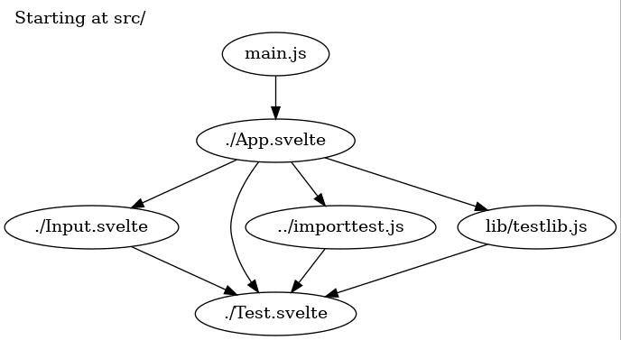

Don't forget to **STAR** this project after you downloaded and made it work!

# Svelte project?
The partially present svelte project here is just for you to test the `walk.js` script. 
This svelte project is just filled with `mport` statements.
Simply  `git clone –-depth 1 https://github.com/j2l/walk-and-graph-svelte-components.git` or npx this project and use it to test (see below).

# Very simple usage
`node walk.js src/main.js`

It's verbose (console logs) to help you if it breaks.
It results in a `dot.dot` file and a `dot.dot.jpg` JPG image showing your components and other imports:

Now, you simply copy walk.js to another project, maybe `grep -R import` to check for format of your import lines and `node walk.js src/main.js`
again.
I intentionally left many comments in the code and a simple dot.dot file for you to study.

# Side Notes
If you want to use in svelte project to help you visualize the dependencies, keep in mind a few things:
- `import` statements must be after at least one line (like `<script>` or an empty line in js files) and must end with `;` (for regex).
- Add an empty line after the imports.
- Not tested with SvelteKit, only tested with Svelte SPA, on Ubuntu with `src/`, the parent folder and one child folder (lib/).
- It's very hacky, full of regex (faster for me than learning libraries that mostly use regex in the end).
- If it breaks, it's your fault :smile: but it's easy to fix, don't hesitate to PR!
